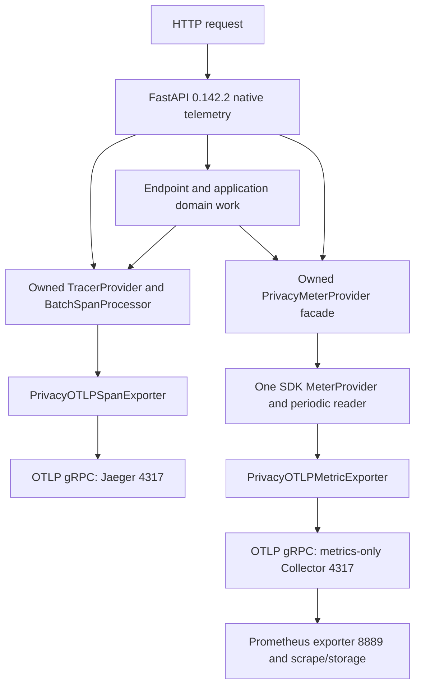

# Observability architecture and acceptance

This repository is a portfolio/reference project. The checks below are reproducible local and CI acceptance; they do not establish a live production deployment, public ingress, external OIDC, production capacity or deployment TLS policy.

## Signal ownership

`app/main.py` and `ObservabilityLifecycle` own bootstrap/shutdown. Native FastAPI receives the exact owned provider objects; it does not auto-configure them. `auto_configure=False`, `logs=False`, and operation spans follow the master trace flag. Neither domain nor native metrics register/adopt the global meter provider. One provider, reader and exporter serve both metric categories.

Framework telemetry covers request/server, dependency, endpoint, serialization and background-task operations. Application spans (`agent.run`, policy, tools, RAG, memory and resilience) remain owned by their domain call sites and inherit the current OTel context. Native operation spans may sit between SERVER and domain spans.

## Enablement

| Master `OTEL_ENABLED` | `OTEL_METRICS_ENABLED` | Traces | Domain/native OTel metrics |
|---|---|---|---|
| false | false/true | No owned pipeline | No owned pipeline |
| true | false | Enabled | No-op |
| true | true | Enabled | Enabled through the same owned facade |

Application configuration defaults to disabled telemetry. Local Compose explicitly enables traces to `http://jaeger:4317`; metrics default off. Start the optional `metrics` profile and explicitly set `OTEL_METRICS_ENABLED=true` to export metrics to the pre-wired Collector endpoint. Profile activation and OTLP environment variables alone do not enable application metrics.

Before successful initialization, disabled/failure states and after owned shutdown, application OTel metrics are no-op. Process-local operational summaries and business/UI projections continue to work independently. A disabled projection need not contain a trace ID. An active provider cannot be reconfigured in place; terminal shutdown requires a new process.

## Privacy and cardinality

The T1 privacy contract remains authoritative. Trace privacy is enforced in the final protobuf projection; metric labels are bounded before recording and again in the final protobuf projection. Raw prompts/messages/bodies, outputs, arguments, retrieved/memory content, identity identifiers, raw URLs/query strings, auth/cookies, credentials, raw exceptions and arbitrary resource/scope metadata are not permitted export channels. Canonical allowed request/run UUIDs can correlate traces; they are never metric labels. Routes use registered templates, unmatched paths do not become route dimensions, and categorical metrics use finite catalogs. Exemplars are disabled.

Raw Uvicorn access records are suppressed. Safe HTTP logs retain bounded method, registered route template or `unmatched`, numeric status and duration. Uvicorn exception records omit raw exception/stack/cause data. Native OTel logs remain off; arbitrary third-party logging is not universally sanitized by this application filter.

Collector deletes resource attributes before Prometheus exposition, excludes resource/scope metadata and has only a metrics pipeline. Prometheus adds fixed static `job`/`instance` scrape metadata. Collector ports are private; Prometheus UI binds to localhost. Default local retention is 7 days/1 GiB. No local Docker-network auth/TLS is claimed.

This metric topology accepts **one producing backend process**. Multiple workers/replicas can collide when cumulative series lack a producer dimension; their metric aggregation is not supported by this acceptance. Do not add identity labels or scale the producer without a separately reviewed design.

## Measured evidence

- [T3 native tracing](fastapi-native-otel-t3-native-tracing.md): framework/domain operations and provider/context contracts.
- [T4D delivery](fastapi-native-otel-t4d-metrics-delivery.md): real authenticated domain/native delivery, actual translated Prometheus names, counter/histogram deltas, privacy and Collector recovery. PR #10 passed remote amd64 CI.
- [T5 runtime/release record](fastapi-native-otel-t5-runtime-release-evidence.md): SIGTERM, in-flight draining, disabled mode and endpoint failure evidence, plus local TLS/auth transport checks.

Successful RPC/export, SDK force-flush and durable backend storage are different claims. Unavailable receivers may lose measurements; no durable replay guarantee is made. Metric/trace failures are observational failures and must not change business correctness or health/readiness semantics. Shutdown timing samples are scenario evidence, not an SLO for arbitrary workload or backend outage.

## Rollback

Apply configuration rollback by starting a **new process**, rather than mutating or restarting a closed provider within the same process.

1. **Disable metrics only:** set `OTEL_METRICS_ENABLED=false`, retain `OTEL_ENABLED=true`, and recreate the backend. Native/domain metric export stops; tracing, projections and process-local summaries remain. The metrics profile may be stopped independently when no longer needed.
2. **Disable all application OTel:** set `OTEL_ENABLED=false` and recreate the backend. The master switch overrides metric flags and OTLP environment variables. Business behavior, projections and operational summaries remain; new trace correlation is unavailable.
3. **Revision rollback:** use a known validated source/image revision with its matching lockfile and configuration. Do not independently restore contrib instrumentation alongside native tracing. Reverting before the native migration requires the earlier code and dependency set together.
4. Verify health/readiness and an authenticated read request after rollback. Check projection/summary behavior and the expected signal enablement state. Preserve PostgreSQL/Qdrant data; do not use the disposable acceptance runner against real application projects or run `down --volumes` as a rollback procedure.

A source rollback is not a database rollback. Review migrations, persistent state compatibility and checkpoints independently; never replay unconfirmed business writes or bypass authorization/confirmation. Future actual deployment requires its own ingress, secret management, TLS/auth, capacity, backup and rollout/drain validation.
